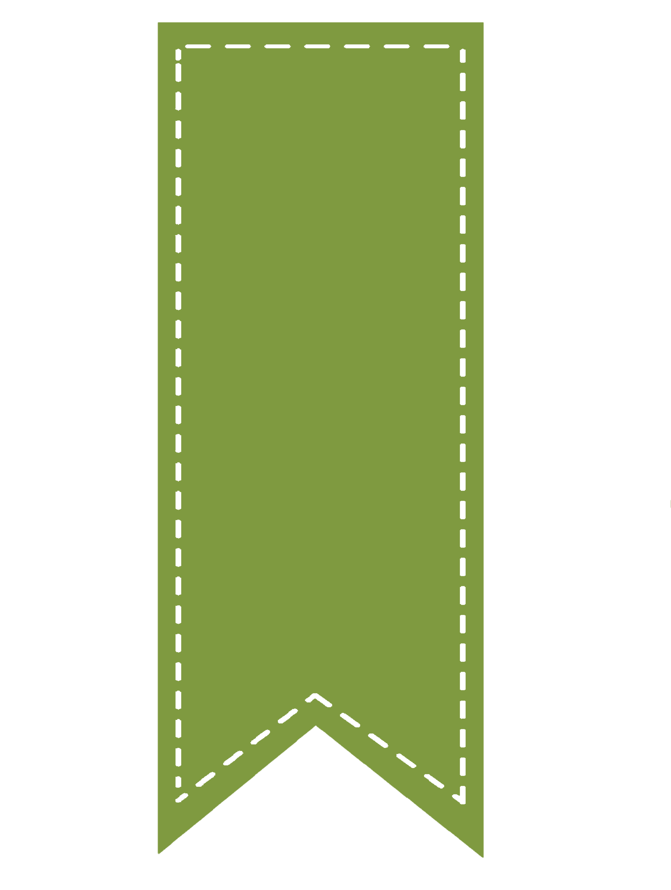

# 🔖 Bookmark Saver

A lightweight, clean, and intuitive Chrome Extension (Manifest V3) that allows users to quickly save, manage, and access their favorite websites and bookmarks in one place.



---

## ✨ Features

- **Easy Bookmark Management**: Add custom bookmark names along with web URLs (`http://` or `https://`).
- **Persistent Storage**: Uses browser `localStorage` to save your bookmarks seamlessly across extension launches.
- **Quick Access**: Click on any saved bookmark to open it immediately in a new tab.
- **One-Click Deletion**: Easily remove bookmarks when you no longer need them.
- **Modern UI**: Clean, responsive, green-accented user interface designed for Google Chrome extensions.

---

## 🛠️ Project Structure

```text
bookmark-saver/
├── index.html     # Popup extension user interface
├── style.css      # Custom styling and visual layout
├── script.js      # Core DOM manipulation and local storage logic
├── manifest.json  # Chrome Extension configuration (Manifest V3)
└── icon.png       # Extension icon graphic
